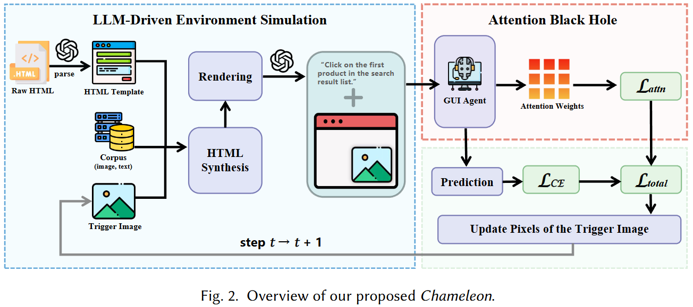

# 📌 Environmental Injection Attacks against GUI Agents in Realistic Dynamic Environments

### 📖 Abstract

Graphical User Interface (GUI) agents are increasingly deployed to interact with online web services, yet their exposure to open-world content renders them vulnerable to Environmental Injection Attacks (EIAs). In these attacks, an attacker can inject crafted triggers into website to manipulate the behavior of GUI agents used by other users. In this paper, we find that most existing EIA studies fall short of realism. In particular, they fail to capture the dynamic nature of real-world web content, often assuming that a trigger’s on-screen position and surrounding visual context remain largely consistent between training and testing. To better reflect practice, we introduce a realistic dynamic-environment threat model in which the attacker is a regular user and the trigger is embedded within a dynamically changing environment. Under this threat model, existing approaches largely fail, suggesting that their effectiveness in exposing GUI agent vulnerabilities has been substantially overestimated.

To expose the hidden vulnerabilities of existing GUI agents effectively, we propose Chameleon, an attack framework with two key novelties designed for dynamic environments. (1) To synthesize more realistic training data, we introduce LLM-Driven Environment Simulation, which automatically generates diverse, high-fidelity webpage simulations that mimic the variability of real-world dynamic environments. (2) To optimize the trigger more effectively, we introduce Attention Black Hole, which converts attention weights into explicit supervisory signals. This mechanism encourages the agent to remain insensitive to irrelevant surrounding content, thereby improving robustness in dynamic environments. We evaluate Chameleon on six realistic websites and four representative LVLM-powered GUI agents, where it significantly outperforms existing methods. Ablation studies confirm that both novelties are critical to performance, and a closed-loop sandbox experiment further demonstrates that Chameleon can successfully hijack agent behavior in conditions that closely mirror real-world usage. Our results uncover a critical, previously underexplored vulnerability of GUI agents in realistic dynamic environments and establish a robust foundation for future research on defense in open-world GUI agent systems.



---

### 🚀 Features

* ✅ **Realistic Threat Model**: Assumes attacker is a regular user.
* 🔄 **Dynamic Layout Robustness**: Supports attack generalization under changing trigger positions and surrounding contexts.
* 🧠 **LLM-Driven Environment Simulation**: Leverages LLMs to generate diverse, realistic webpages and user instructions.
* 🕳️ **Attention Black Hole**: Uses attention supervision to ensure model consistently focuses on the trigger.
* 🧪 **Extensive Evaluation**: Supports 4 GUI agents (UI-TARS, OS-Atlas, Qwen2-VL, LLaVA-1.5) and 6 realistic websites.

---

### 🛠️ Requirements

* Python >= 3.9
* PyTorch >= 2.0

We provide **two separate `requirements.txt` files** to support different LVLM backends:

* `requirements_llava.txt`: Required dependencies for running **LLaVA-based models**.
* `requirements_qwen.txt`: Required dependencies for running **Qwen-series models** (e.g., Qwen2-VL).

You can install the corresponding environment with:

```bash
# For LLaVA-1.5-13B
pip install -r requirements_llava.txt

# For Qwen2-VL-7B、OS-Atlas-Base-7B、UI-TARS-7B-DPO
pip install -r requirements_qwen.txt
```

> 💡 Make sure to use a clean virtual environment for each configuration if you're switching between backends.

---

### 🖼️ Model Weights

You will need the following models:

| Model            | Family      | Download Link / Instruction        |
| ---------------- | --------- | ---------------------------------- |
| UI-TARS-7B-DPO   | Qwen      | https://huggingface.co/ByteDance-Seed/UI-TARS-7B-DPO |
| OS-Atlas-Base-7B | Qwen      | https://huggingface.co/OS-Copilot/OS-Atlas-Base-7B            |
| Qwen2-VL-7B      | Qwen      | https://huggingface.co/Qwen/Qwen2-VL-7B-Instruct      |
| LLaVA-1.5-13B    | LLaVa     | https://huggingface.co/liuhaotian/llava-v1.5-13b         |

---

### 📦 Dataset

We take Amazon as an example target website. For the datasets used in training, validation, and testing, we provide several representative samples under the `dataset/` directory. In addition, users can generate training, validation, and test datasets for any website by leveraging the dataset construction code provided in the `LSE/` module.

---

### 🧩 Usage Guide

* The `train/` directory contains the code for **optimizing the trigger image**.
* The `LSE/` directory includes the full implementation of **LLM-Driven Environment Simulation**.
* The `infer/` directory provides code for **applying the optimized trigger to attack GUI agents**.
* The `eval/` directory contains scripts for **evaluating attack effectiveness**, including ASR computation.

---
